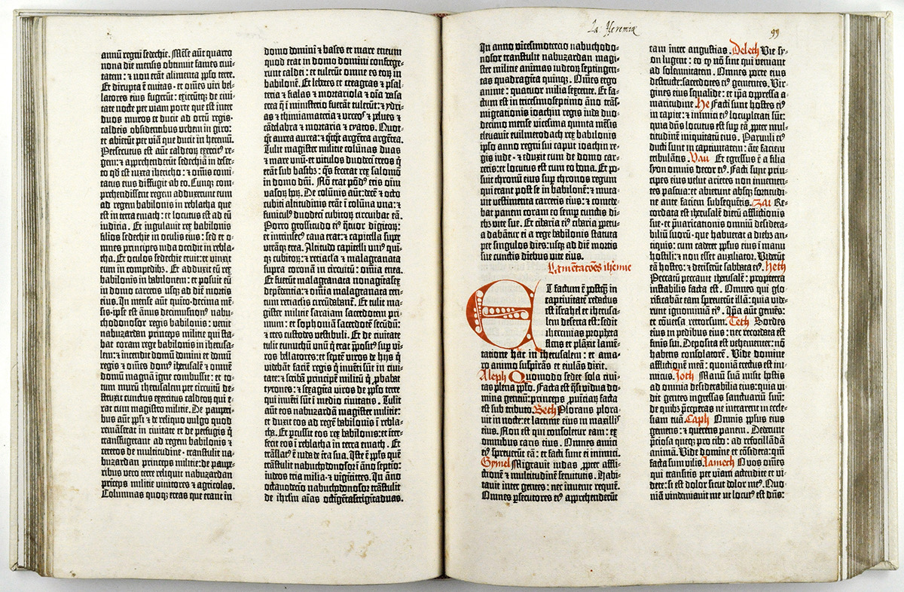

The Blackletter typeface (also sometimes referred to as *Gothic*, *Fraktur* or *Old English*) was used in the Guthenburg Bible, one of the first books printed in Europe. This style of typeface is recognizable by its dramatic  thin and thick strokes, and in some fonts, the elaborate swirls on the serifs. Blackletter typefaces are based on early manuscript lettering.

## History in Europe

They evolved in Western Europe from the mid twelfth century. Over time a wide variety of different blackletters appeared, but four major families can be identified: Textura, Rotunda, Schwabacher and Fraktur. It’s beyond the scope of this article to go into each one, but if you look at the letter “o” in the chart below you will see the difference.

> The basic black letter scripts are **textura** and rotunda, the former primarily associated with northern Europe and the latter with southern Europe. These are both book scripts.